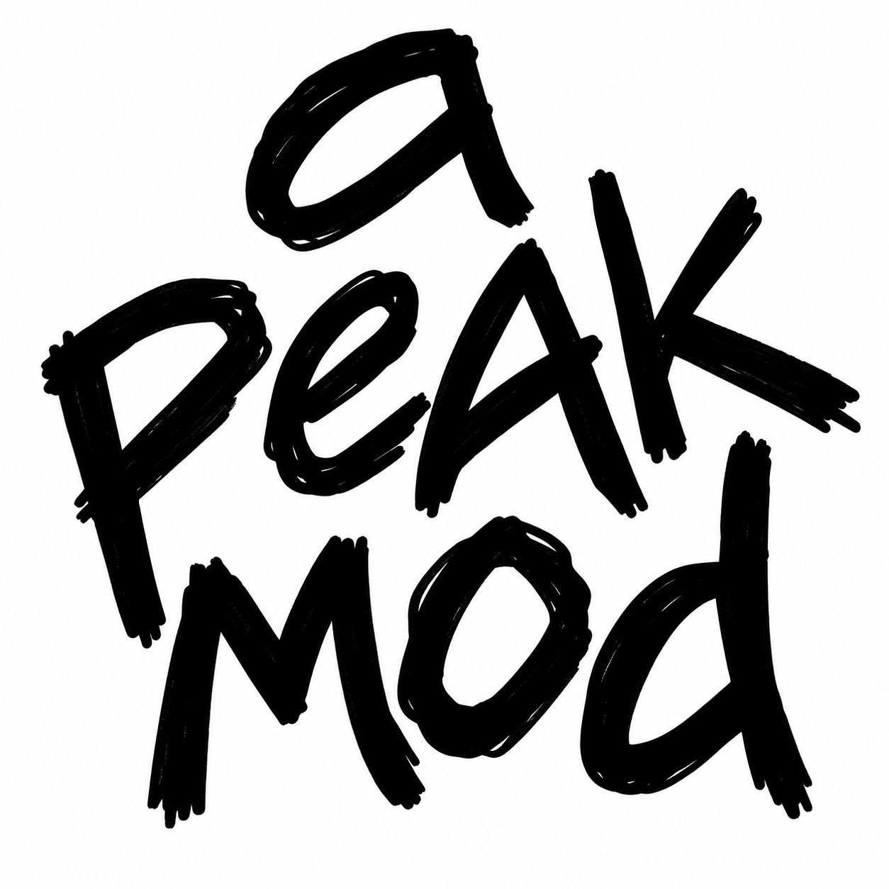

<p align="center">
  
</p>

<h1 align="center">PeakMod V0.3.1</h1>

<p align="center">
  A feature-rich quality-of-life and utility mod for <b>PEAK</b> built on BepInEx + DearImGuiInjection.
</p>

> **PEAK Version:** 2.3.a

> **Disclaimer:** This mod is provided **as-is** for fun and educational/personal use. It targets a specific build of PEAK and **will not always be updated** when features break or the game changes. Don't expect ongoing maintenance — contributions are welcome though!

## Install

### Thunderstore (Recommended)
1. Install [Thunderstore Mod Manager](https://get.thunderstore.io/) or [r2modman](https://thunderstore.io/c/peak/p/ebkr/r2modman/)
2. Search for **PeakMod** in the PEAK community
3. Click Download — BepInEx and DearImGuiInjection are installed automatically

### GitHub (Manual)
1. Install [BepInEx](https://github.com/BepInEx/BepInEx/releases) (x64) into your PEAK game folder
2. Run the game once to generate the BepInEx folder structure
3. Download [DearImGuiInjection](https://thunderstore.io/c/peak/p/penswer/DearImGuiInjection/) and copy `DearImGuiInjection.dll` into `BepInEx/plugins/`
4. Download `PeakMod.dll` from [Releases](https://github.com/TheLocalAdmin/PeakMod/releases/tag/v0.2.0) and copy it into `BepInEx/plugins/`
5. Launch the game and press **Fn + Insert** to open the menu

## Features

- **Player Mods** — Infinite stamina, freeze afflictions, no-weight, unlimited item uses, no-status toggles (eat/injury/cold/poison/curse/hot/spores/petrify/ragdoll — all local only), speed/jump/climb/vine/rope/fly modifiers, no fall damage, teleport to ping.
- **Inventory** — Real-time slot editing (assign any item), recharge item charges, searchable item list.
- **Spawn** — Spawn any item into any player's hand (works as non-host via client-legal RPCs).
- **Lobby** — Player list, revive/kill, warp to/warp to me, teleport players to custom coordinates, spawn Scoutmaster (host only). Safe respawn with ground detection (no more airport fly-ups!).
- **World** — Find and interact with nearby containers/luggage, open all nearby, warp to luggage, luggage ESP with configurable glowing boxes.
- **Stages** — Teleport to any mountain stage (Beach to Peak).
- **Achievements** — Unlock all badges and grant ascent levels.
- **Host Only** — Kick, give any status, remove/fill inventory slots, pass out, zombify, backpack control. Only works when you are the session host (MasterClient).
- **Coordinate Overlay** — Toggle via checkbox or custom keybind to show your position, all players with distance, and nearby containers.
- **Custom Keybinds** — Assign keys for fly mode and coordinate overlay that save to your profile.
- **Profile** — Save/load all PLAYER tab options including custom keybinds to `BepInEx/config/PeakModPlayerProfile.json`.

## Controls

| Key | Action |
|-----|--------|
| **Fn + Insert** | Open/close mod menu |
| **Custom** | Any self mod can be bound to a key (see Keybinds below) |

> **Note:** You must close the menu (press Fn + Insert again) before you can move your character.

### Changing the Menu Key
1. Close the game
2. Open `BepInEx/config/iDeathHD.DearImGuiInjection.cfg`
3. Under `[Keybinds]`, change `CursorVisibility = Insert` to your preferred key
4. Save and launch

### Custom Keybinds
Keybinds are set in `BepInEx/config/com.thelocaladmin.peakmod.cfg` under `[Keybinds]`. Set any key name below or `None` to disable.

```ini
[Keybinds]
; set a key name (e.g. F5, Alpha1, Keypad0) or None to disable
InfiniteStamina = None
FreezeAfflictions = None
NoWeight = None
UnlimitedItemUses = None
SpeedMod = None
JumpMod = None
ClimbMod = None
VineClimbMod = None
RopeClimbMod = None
TeleportToPing = None
FlyMod = F5
ShowPlayerMarkers = None
ShowCoordOverlay = None
```

**Key names (case-sensitive):**
- **F keys:** `F1`, `F2`, `F3`, `F4`, `F5`, `F6`, `F7`, `F8`, `F9`, `F10`, `F11`, `F12`, `F13`, `F14`, `F15`, `F16`, `F17`, `F18`, `F19`, `F20`, `F21`, `F22`, `F23`, `F24`
- **Number row:** `Alpha0`, `Alpha1`, `Alpha2`, `Alpha3`, `Alpha4`, `Alpha5`, `Alpha6`, `Alpha7`, `Alpha8`, `Alpha9`
- **Numpad:** `Keypad0`, `Keypad1`, `Keypad2`, `Keypad3`, `Keypad4`, `Keypad5`, `Keypad6`, `Keypad7`, `Keypad8`, `Keypad9`, `KeypadPeriod`, `KeypadDivide`, `KeypadMultiply`, `KeypadMinus`, `KeypadPlus`, `KeypadEnter`, `KeypadEquals`
- **Letters:** `A` through `Z` (uppercase)
- **Navigation:** `Insert`, `Delete`, `Home`, `End`, `PageUp`, `PageDown`
- **Arrows:** `UpArrow`, `DownArrow`, `LeftArrow`, `RightArrow`
- **Mouse:** `Mouse0`, `Mouse1`, `Mouse2`, `Mouse3`, `Mouse4`, `Mouse5`, `Mouse6`
- **Other:** `Space`, `Return`, `Escape`, `Tab`, `Backspace`, `Delete`, `Comma`, `Period`, `Slash`, `Backslash`, `Minus`, `Equals`, `LeftBracket`, `RightBracket`, `Semicolon`, `Quote`, `BackQuote`
- **Modifiers:** `LeftShift`, `RightShift`, `LeftControl`, `RightControl`, `LeftAlt`, `RightAlt`
- **Disable:** `None`

Full reference: [Unity KeyCode docs](https://docs.unity3d.com/ScriptReference/KeyCode.html)

## What's New in V0.3.1

- **Removed:** Vanish mode, No Fog, Team tab — streamlined to focus on core features
- **New:** Coordinate overlay is now a checkbox in Self Mods (no fixed keybind)
- **New:** Custom keybinds for fly mode and coordinate overlay (saves to profile)
- **Moved:** Teleport-to-coordinates moved from Player to Lobby tab — teleport selected players to specific coordinates
- **Updated:** About tab with current feature list

## Building from Source

Build with .NET Framework 4.7.x referencing the game's assemblies. The project uses HarmonyX for runtime patching and DearImGuiInjection for UI integration.

```
cd PeakMod
dotnet msbuild PeakMod.csproj -t:Build -p:Configuration=Release
```

Output: `PeakMod/bin/Release/PeakMod.dll`

## Repository Layout

```
PeakMod/
├── BepInEx/plugins/PeakMod.dll    ← prebuilt plugin, ready to install
├── PeakMod/                       ← full C# source (open source)
├── thunderstore/                  ← Thunderstore package files
├── icon.png
├── README.md
└── ...
```

## Credits

- [Penswer](https://github.com/Penswer/DearImGuiInjection) ([Thunderstore](https://thunderstore.io/c/peak/p/penswer/DearImGuiInjection/)) — for insight, guidance, and DearImGuiInjection
- [BepInEx](https://github.com/BepInEx/BepInEx) ([Thunderstore](https://thunderstore.io/c/peak/p/BepInEx/BepInExPack_PEAK/)) — for the modding framework
- [DearImGuiInjection](https://thunderstore.io/c/peak/p/penswer/DearImGuiInjection/) — for seamless UI integration
- [HarmonyX](https://github.com/pardeike/Harmony) — for runtime patching support

## License / Legal

Not affiliated with or endorsed by the developers of PEAK. Use responsibly at your own risk.
